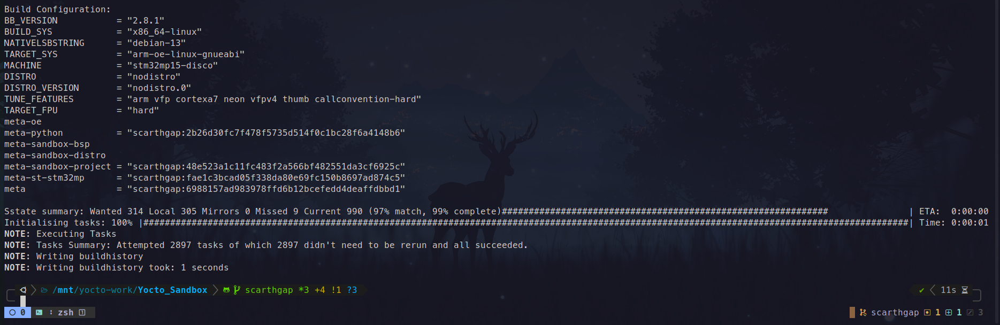

# Milestone 1: Project Structure & Reproducibility

## Goal
Establish a portable and reproducible Yocto Project environment that eliminates host dependency issues and enables consistent builds across machines.

## Target Hardware
- SoC: STM32MP157C
- Board: STM32MP157C-DK2 (not yet flashed in this milestone)
- Bootloader: U-Boot (handled in later milestones)
- Storage: SD-Card

## Yocto Context
- Yocto Release: scarthgap
- Build Orchestration: KAS
- Container Runtime: Docker
- Distro: nodistro (Will be developed in next milestone)
- BSP Layer: meta-st-stm32mp
- Target Image: core-image-minimal

## Tasks Covered
- [x] Create project repository structure
- [x] Add script to create Docker-based Yocto build environment
- [x] Create initial KAS YAML configuration
- [x] Fetch required Yocto layers using KAS
- [x] Configure shared downloads directory
- [x] Configure shared sstate-cache directory
- [x] Enable build history
- [x] Enable image build information
- [x] Verify build succeeds after deleting `tmp/`
- [x] Document build workflow

## Design Decisions
| Decision                                   | Reason                                                 |
| ------------------------------------------ | ------------------------------------------------------ |
| Use Docker for builds                      | Eliminate host toolchain and control build environment |
| Use KAS instead of manual layer management | Declarative, reproducible layer configuration          |
| Separate BSP, distro, and project layers   | Clean architecture and scalability                     |
| Shared downloads/sstate directory          | Faster rebuilds                                        |

## Implementation

### Project Structure

```text
Yocto_Sandbox/
├── docker/
│   └── start_container.sh
├── docs/
│   ├── assets/
│   ├── milestones/
│   │   └── milestone-01.yml
│   └── CHANGELOG.md
├── kas/
│   ├── include/
│   │   ├── common.yml
│   │   ├── local.yml
│   │   ├── oe.yml
│   │   └── stm32mp.yml
│   └── kas-core-image-minimal-stm32mp15.yml
├── meta-sandbox-bsp/
├── meta-sandbox-distro/
├── meta-sandbox-project/
└── README.md
```
### Docker Script Creation

The script acts as a single entry point for the Yocto build environment, abstracting Docker invocation and KAS execution.  
It ensures a consistent workflow by standardizing commands for layer checkout, image build, and interactive shell access, while transparently handling shared downloads and sstate-cache directories.

### KAS Configuration

The KAS configuration is designed to be modular, customizable, and scalable to support future image variants.  
This is achieved by splitting the configuration into multiple reusable YAML files that can be selectively included as needed.

Each image is associated with its own KAS configuration, allowing image-specific customization while keeping the overall setup hardware-agnostic. This approach enables clean separation of concerns and simplifies the addition of new images or feature sets without impacting existing configurations.

### Fetching Required Yocto Layers Using KAS

When the Docker script is executed (via the configured alias), it first sources the virtual environment. It then checks whether the required Yocto layers are already present locally. If any layers are missing, they are automatically cloned.

Each layer is pinned to a specific commit corresponding to the latest version compatible with the Scarthgap release at the time of setup. This ensures build reproducibility and consistency across different users and environments.


### Verifying Build Succeeds After Deleting

