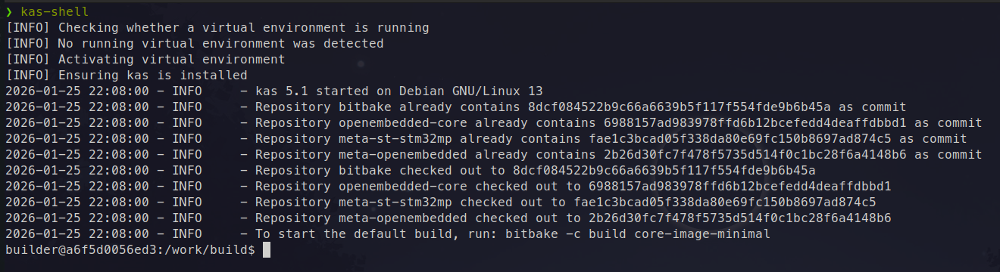
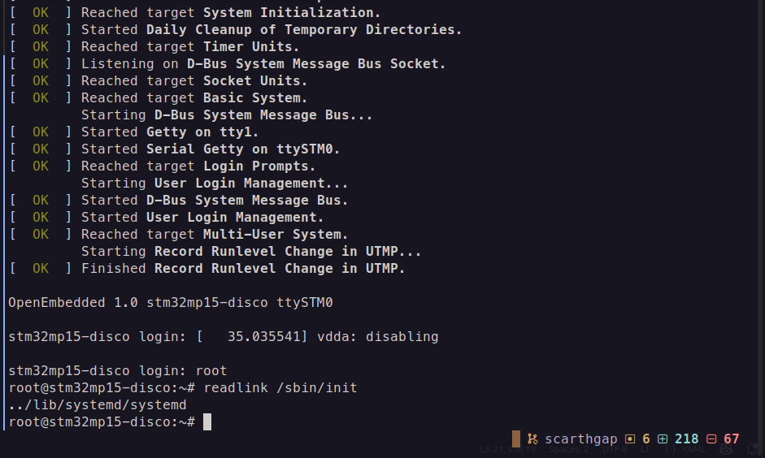
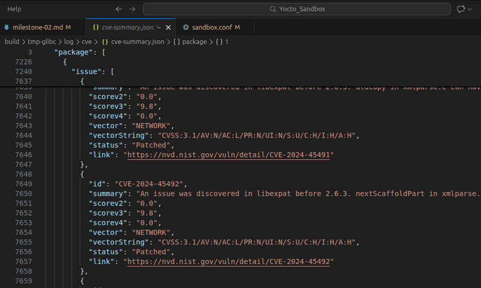

# Milestone 2: Custom Distribution Layer

## Goal
Design and implement a custom Yocto distribution that fully controls system-wide features, policies, licensing, and security, while providing reproducible development and release build configurations.

## Tasks Covered
- [x] Create custom distro layer
- [x] Register distro layer in KAS
- [x] Define custom DISTRO name
- [x] Define and sanitize DISTRO_FEATURES
- [x] Remove unused default features
- [x] Validate feature propagation to packages
- [x] Add switchable init system support (systemd / sysvinit)
- [x] Validate both init systems build and boot
- [x] Disable recommended packages globally
- [x] Control PACKAGE_EXCLUDE globally
- [x] Define build type variable (dev / release)
- [x] Apply build type logic globally (not in images)
- [x] Ensure build type affects optimization, debug, and features
- [x] Enable CVE checking
- [x] Validate CVE reports generation
- [x] Disable GPLv3 packages (Will be re-enabled after creating a custom image from scratch)
- [x] Generate license manifest
- [x] Enable build history and build info globally
- [x] Ensure distro logic does not leak into BSP
- [x] Ensure distro logic does not leak into images
- [x] Document distro design decisions

## Implementation

### Create Custom Distro Layer
The custom distro layer is created from inside the KAS build shell using the standard BitBake helper:
```bash
bitbake-layers create-layer meta-sandbox-distro
```
Since this command is executed inside a Docker container, any newly created layers will initially appear relative to the working directory inside the container. To keep the project structure consistent and aligned with the repository layout defined earlier, the default Yocto working directories must be overridden.

This is done by updating the `local.yml` KAS configuration file.

First, the downloads directory (`DL_DIR`) and the shared state cache (SSTATE_DIR) are redirected to a mounted shared volume to allow reuse across builds and hosts:
```yaml
  yocto_environment_config: |
    DL_DIR = "/YoctoShare/downloads"
    SSTATE_DIR = "/YoctoShare/sstate-cache"
```
Next, the build directory and temporary directory are explicitly set to live inside the project workspace:
```yaml
    BUILDDIR = "/work/build"
    TMPDIR = "/work/build/tmp"
```
To simplify layer management and access, the BitBake layer fetch path is aligned with the project’s directory structure. Finally, the newly created distro layer is added to the KAS configuration:
```yaml
repos:
  meta-sandbox-distro:
    path: meta-sandbox-distro
```
At this point, the custom distro layer is fully integrated and ready to host system-wide policy.
---

### Define and Sanitize `DISTRO_FEATURES`
The default distro feature set includes support for many features that are not required for this project. Leaving them enabled would introduce unnecessary dependencies and increase image size.
To avoid this, the feature set is explicitly sanitized by removing unused features:
```bash
DISTRO_FEATURES:remove = "alsa bluetooth debuginfod wifi ipv6 debuginfod pcmcia usbgadget pci 3g nfc x11 pulseaudio"
DISTRO_FEATURES_DEFAULT:remove = "alsa bluetooth debuginfod wifi ipv6 debuginfod pcmcia usbgadget pci 3g nfc x11 pulseaudio"
```
This ensures that only intentionally selected features influence package configuration and dependency resolution.

#### Distro Features Validation
The effective feature set is validated from within the KAS shell to confirm that the configuration is applied correctly:


### Controlling Init System
The init system is selected using an environment variable exposed to BitBake and injected via the KAS configuration. This allows switching between init systems without modifying images, BSP metadata, or recipes.

In the KAS YAML configuration file:
```yaml
env:
  INITM_VAR: "systemd"
```

Switching to `sysvinit` requires only changing this value:

```yaml
env:
  INITM_VAR: "sysvinit"
```

The variable is then consumed by the custom distro configuration:
```bash
INIT_MANAGER = "${INITM_VAR}"
```
This approach keeps init system selection firmly at the distro level and avoids policy leakage into other layers.

### Disable Recommended Packages Globally
To maintain full control over the root filesystem contents, implicit package installation via `RRECOMMENDS` is disabled globally.

This is achieved by adding the following to the `sandbox.conf` distro configuration file:
```bash
NO_RECOMMENDATIONS = "1"
```
All required packages are then pulled in explicitly via `RDEPENDS` or project-specific packagroups, ensuring predictable and minimal images.

### Define Development and Release Build Modes
The goal here is to provide a single, global mechanism to switch between development and production builds without modifying image recipes.

**Step 1: Define the Build Type**

```bash
BUILD_TYPE ?= "release"
```

**Step 2: Apply Global Build Logic**

```bash
EXTRA_IMAGE_FEATURES:append = "${@bb.utils.contains('BUILD_TYPE', 'dev', ' dbg-pkgs tools-debug debug-tweaks', '', d)}"
```

This logic checks whether `BUILD_TYPE` is set to `dev`. If so, debugging-related image features are enabled. Otherwise, the build defaults to a production-ready configuration.

**Step 3: Adjust Compiler and Packaging Behavior**

```bash
DEBUG_BUILD = "${@bb.utils.contains('BUILD_TYPE', 'dev', '1', '0', d)}"
INHIBIT_PACKAGE_DEBUG_SPLIT = "${DEBUG_BUILD}"
```
When building in development mode, debug symbols are kept inside the packages to improve debuggability. In release builds, normal package splitting behavior is restored.

### Enable CVE Checking
To continuously monitor known vulnerabilities in all included packages, CVE checking is enabled globally at the distro level:
```bash
INHERIT += "cve-check"
```
This ensures vulnerability information is generated automatically during builds without requiring per-image configuration.


### License Policy and Compliance
For a production-oriented project, licensing constraints must be enforced early. Packages licensed under GPLv3 or LGPLv3 impose obligations that may not align with commercial or closed deployments.

To avoid this risk, incompatible licenses are excluded globally:
```bash
INCOMPATIBLE_LICENSE = "GPL-3.0* LGPL-3.0*"
```
To maintain full traceability, license manifest generation is also enabled:
```bash
INHERIT += "license"
```
This provides a complete overview of all licenses present in the final image.

### Enable Build History and Build Info Globally
To ensure that every build produces traceable and auditable metadata, build history and image build information are enabled globally:
```bash
INHERIT += "buildhistory image-buildinfo"
BUILDHISTORY_FEATURES = "image"
```
This allows changes between builds to be tracked and analyzed without additional configuration.

### Prevent Policy Leakage Across Layers
Preventing policy leakage across layers ensures that there is a strict separation of concerns enforced between distro, BSP, and image layers, the rule according to the documentation is explained as follows:
- Distro layer: Defines features, policies, security, and build behavior
- BSP layer: Describes hardware only (bootloader, kernel, device tree)
- Image layer: Lists packages and packagroups only
Maintaining this separation ensures that layers remain reusable, interchangeable, and maintainable over time.