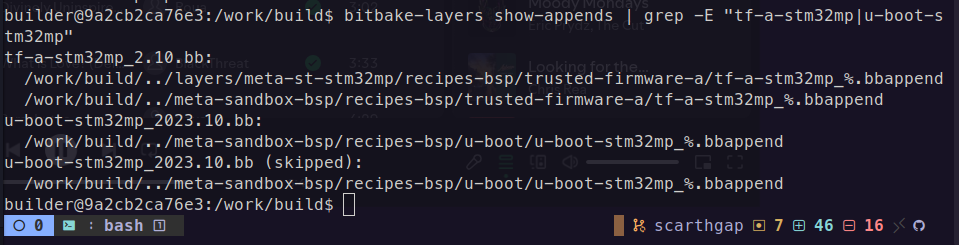
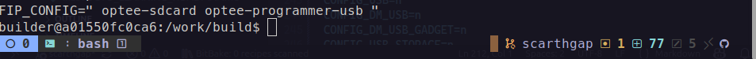
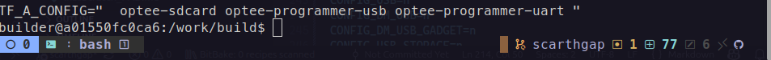
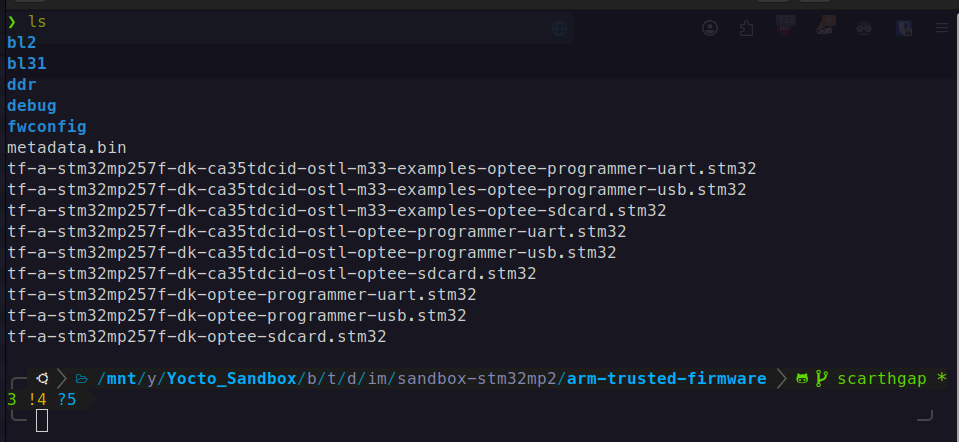
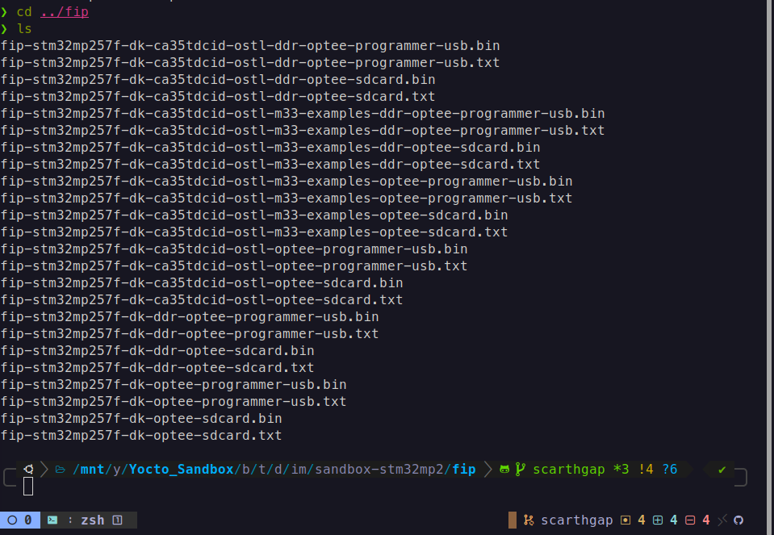
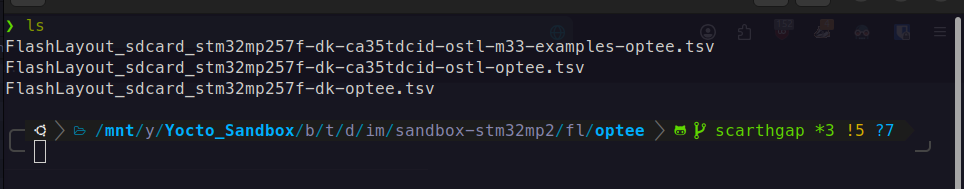
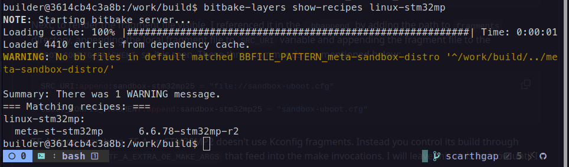
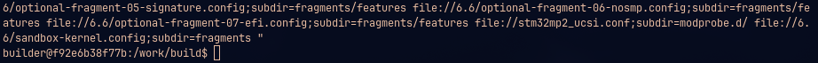
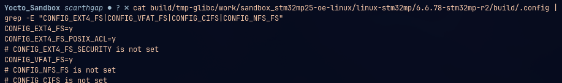

# Milestone 3: BSP & Machine Control

## Goal
Describe and control all hardware behavior through Yocto metadata only.

## Tasks Covered
- [x] Create custom BSP layer
- [x] Register BSP layer in KAS
- [x] Define custom MACHINE configuration
- [x] Define machine overrides correctly
- [x] Define CPU, FPU, and tuning variables
- [x] Validate MACHINE selection via override
- [x] Select bootloader strategy (U-Boot / vendor)
- [x] Integrate bootloader recipe
- [x] Apply bootloader configuration fragments
- [x] Disable unused bootloader features
- [x] Validate bootloader deployment artifacts
- [x] Select kernel source strategy (vendor / mainline / custom)
- [x] Pin kernel version explicitly
- [x] Integrate custom kernel recipe
- [x] Apply kernel configuration fragments
- [x] Validate fragment application order
- [ ] Remove unnecessary kernel options
- [ ] Remove kernel image from root filesystem
- [ ] Integrate base device tree
- [ ] Validate DT selection via MACHINE
- [ ] Create DT overlay recipe
- [ ] Enable DT overlay loading in bootloader
- [ ] Validate overlays load at boot
- [ ] Create kernel module recipes (in-tree / out-of-tree)
- [ ] Control module auto-loading
- [ ] Remove unused drivers
- [ ] Disable unused peripherals and buses
- [ ] Tune clocks, regulators, and power management
- [ ] Measure baseline boot time
- [ ] Enable kernel boot profiling
- [ ] Optimize bootloader delays
- [ ] Optimize kernel and init sequence
- [ ] Validate improved boot time
- [ ] Validate storage drivers and rootfs mount
- [ ] Ensure compatibility with WIC / FlashLayout
- [ ] Enable early boot logs
- [ ] Validate serial console output
- [ ] Validate panic and reboot behavior
- [ ] Ensure BSP logic does not leak into distro or images
- [ ] Document BSP constraints and assumptions

## Implementation

### Create Custom BSP Layer

A dedicated BSP layer was created to host all board-specific configurations and overrides.

```bash
bitbake-layers create-layer meta-sandbox-bsp
```
This layer is responsible exclusively for:

- Machine definitions
- Bootloader customizations
- Kernel configuration fragments
- Hardware-specific overrides

No system policy or image logic is introduced here.

### Register BSP Layer in KAS

The newly created BSP layer was registered in the KAS configuration to ensure reproducible builds.

```yaml
repos:
  meta-sandbox-bsp:
    path: meta-sandbox-bsp
```
Layer priority is increased to ensure that BSP overrides take precedence over vendor layers without modifying them.

```bitbake
BBFILE_PRIORITY_meta-sandbox-bsp = "7"
```

### Define Custom MACHINE Configuration

To define a custom machine, a configuration file was created in the following directory
`meta-sandbox-bsp/conf/machine/sandbox-stm32mp15.conf`. To preserve ST's baseline and allow controlled overrides, the following line must be added at the top of the configuration file created earlier.
```bitbake
require conf/machine/stm32mp15-disco.conf
```
This way, the newly created machine uses ST's configuration by default unless overwritten.

### Define Machine Overrides Correctly

Adding a machine override is essential as it allows for board-specific tuning from now on.
```bitbake
MACHINEOVERRIDES =. "sandbox:"
```
Doing so, I am now able to do something like this:
```bitbake
VARIABLE:sandbox = "value"
```

### Define CPU, FPU, and Tuning Variables

Tuning variables that are provided by ST are already verified and align with STM32MP.
To get the list of default tuning variables, this command must be executed:
```bash
bitbake-getvar DEFAULTTUNE
```


### Narrow BOOTSCHEME_LABELS and BOOTDEVICE_LABELS
The ST defaults enable every possible combination (emmc, nand, nor, sdcard, etc.), which causes the build to generate a huge matrix of FlashLayout files. In this project's case, the application will boot only from SD card with OP-TEE, the other boot options can be disabled for now.
```bitbake
BOOTSCHEME_LABELS = "optee"
BOOTDEVICE_LABELS = "sdcard"
```

### Validate MACHINE Selection via Override

To validate that the custom machine is correctly selected and that overrides are applied as expected:
```bash
bitbake-getvar MACHINE
```


### Select Bootloader Strategy (Vendor U-Boot)

STM32MP157 uses the following boot chain:
```code
ROM => TF-A => U-Boot => Linux => RootFS
```
STM32MP257 uses the following boot chain:
```code
ROM → TF-A (BL2) → FIP → { OP-TEE (BL32) + TF-M + U-Boot (BL33) } → Linux
```
The vendor-provided U-Boot and TF-A are retained to ensure hardware compatibility and stability. The bootloader provider is explicitly set inside the machine configuration provided by ST:
```bitbake
PREFERRED_PROVIDER_virtual/bootloader = "u-boot-stm32mp"
```

### Integrate bootloader recipe

The ST-provided bootloader recipe is already integrated without modification. In order to adjust it to the needs of this project, i need to append to `u-boot` and `tf-a` recipes to control fragments, config and deploy behavior without touching the ST layer. To achieve that, I created the the following structure and a .bbappend file under meta-sandbox-bsp directory.
```bash
meta-sandbox-bsp/
└── recipes-bsp/
    ├── trusted-firmware-a/
    │   ├── tf-a-stm32mp/
    │   └── tf-a-stm32mp_%.bbappend
    └── u-boot/
        ├── u-boot-stm32mp/
        └── u-boot-stm32mp_%.bbappend
```
For now, I'll keep them minimal by prepending FILESEXTRAPATHS variable so that they're ready to accept fragments modifications.

```bitbake
# meta-sandbox-bsp/recipes-bsp/trusted-firmware-a/tf-a-stm32mp_%.bbappend

FILESEXTRAPATHS:prepend := "${THISDIR}:${PN}"
```
```bitbake
# meta-sandbox-bsp/recipes-bsp/u-boot/u-boot-stm32mp_%.bbappend

FILESEXTRAPATHS:prepend := "${THISDIR}/${PN}:"
```
This preserves vendor updates while allowing controlled customization. 
To verify if the recipes are visible to BitBake:
```bash
bitbake-layers show-appends | grep -E "tf-a-stm32mp|u-boot-stm32mp"
```
Doing so return the following the output:

This confirms that recipe appends are visible to Bitbake and customizations will be taken into account.

### Apply bootloader configuration fragments

Bootloader configuration is customized using configuration fragments rather than modifying vendor defconfigs directly.

**U-Boot fragments**

First, I started by creating a defconfig fragment config file named `sandbox-uboot.cfg` under `u-boot-stm32mp/`:
```bash
u-boot/
    ├── u-boot-stm32mp/
    │   └── sandbox-uboot.cfg
    └── u-boot-stm32mp_%.bbappend
```
Before going in-depth on what to disable, i added only one modification to bootloader config to test whether the changes were affected post baking or not. As a start, I enabled SD-card and eMMC options.
```cfg
CONFIG_MMC=y
CONFIG_CMD_MMC=y
```
Next, to make the fragment file visible to bitbake, I appended it to `SRC_URI` and `UBOOT_CONFIG_FRAGMENT` variables as can be seen below:
```bitbake
SRC_URI:append:sandbox-stm32mp25 = " file://sandbox-uboot.cfg;subdir=fragments "

UBOOT_CONFIG_FRAGMENT:append:sandbox-stm32mp25 = " ${WORKDIR}/fragments/sandbox-uboot.cfg "
```

**TF-A**
Upon searching, TF-A on STM32MP2 doesn't use Kconfig fragments. Instead you control its build through BitBake variable `TF_A_EXTRA_OE_MAKE_ARGS` that feed into the make invocations. I will leave this as is for now until I see the need to change it.

Now, It is time to validate the changes. First, I will start by building u-boot-stm32mp using the following command:
```bash
bitbake u-boot-stm32mp
```
Then, I need to inspect the generated defconfig and search for the customization I applied earlier. In most cases, it is found under the following directory.
```bash
cat tmp-glibc/work/sandbox_stm32mp25-oe-linux/u-boot-stm32mp/v2023.10-stm32mp-r2/build/stm32mp25_defconfig/.config | grep -E "CONFIG_MMC=y|CONFIG_CMD_MMC=y"
```
And thankfully, as can be seen in the screenshot below, the changes were affected successfully! 

Now, I can move on to the next step; researching the features I need to keep disabling the rest.

### Disable unused bootloader features

The philosophy behind this is simple, as long as i'm not using it now, I disable it. this saves bootloader size and limits the flexibility provided by default. With that in my mind, disabling unused features can be done through two mechanisms, first method is through fragment customization handled during compilation and the second by scoping `BOOTDEVICE_LABLES` to include only needed artifacts for storage devices used. I already applied the latter method earlier in this guide and this is the result:




Currently, this is the list of features disabled which will be updated further in the project:
```cfg
# Disable unused storage drivers
# CONFIG_MTD_RAW_NAND is not set
# CONFIG_SPI_FLASH_MACRONIX is not set
# CONFIG_SPI_FLASH_WINBOND is not set

# Keep SD card and eMMC
CONFIG_MMC=y
CONFIG_CMD_MMC=y

```

### Validate bootloader deployment artifacts

After successful completion of build, artifacts can be checked under `tmp-glibc/deploy/images/sandbox-stm32mp25/` directory.
**TF-A artifacts:**

tf-a-stm32mp257f-dk-optee-sdcard.stm32: BL2 binary loaded by ROM
metadata.bin: required for firmware update (fw-update feature is on by default)



**FIP artifacts (this is the new concept vs MP1):**

fip-stm32mp257f-dk-optee-sdcard.bin: the bundled BL32+BL33 image



**FlashLayout file:**

flashlayout_core-image-minimal/optee/FlashLayout_sdcard_stm32mp257f-dk2-optee.tsv



### Select kernel source strategy (vendor / mainline / custom) + Pin kernel version

As stated in the task name, three possible ways to choose from: vendor provided kernel, maineline or custom. In my case I decided to go with kernel provided by ST to reduce the complexity of this project and maybe tackle the other options in the future. After choosing so, all I need to do is to check what version ST's scarthgap layer currently ships:
```bash
bitbake-layers show-recipes linux-stm32mp
```

and lock the preferred provider and version in my machine conf.

```bitbake
# meta-sandbox-bsp/conf/machine/sandbox-stm32mp25.conf

PREFERRED_PROVIDER_virtual/kernel = "linux-stm32mp"
PREFERRED_VERSION_linux-stm32mp = "6.6.78-stm32mp-r2"
```

### Integrate custom kernel recipe

Same pattern as U-Boot, all I need to do is append to the recipe by creating the following directory tree and bbappend file that mirror the one used by meta-st layer.
```bash
meta-sandbox-bsp/recipes-kernel/linux/
├── linux-stm32mp/
│   └── 6.6/
└── linux-stm32mp_%.bbappend
```
```bitbake
# meta-sandbox-bsp/recipes-kernel/linux/linux-stm32mp_%.bbappend

FILESEXTRAPATHS:prepend := "${THISDIR}/${PN}:"
```
Create the kernel fragment:
```bash
meta-sandbox-bsp/recipes-kernel/linux/linux-stm32mp/6.6
└── sandbox-kernel.config
    
```
Same thing with kernel fragment, I referenced the file by appending it to SRC_URI and KERNEL_CONFIG_FRAGMENTS variables.

```bitbake
# linux-stm32mp_%.bbappend

SRC_URI:append:sandbox-stm32mp25 = " file://${LINUX_VERSION}/sandbox-kernel.config;subdir=fragments "

KERNEL_CONFIG_FRAGMENTS:append:sandbox-stm32mp25 = " ${WORKDIR}/fragments/${LINUX_VERSION}/sandbox-kernel.config "
```
Now, I can fetch SRC_URI sources associated with linux-stm32mp recipe:
```bash
bitbake-getvar -r linux-stm32mp SRC_URI
```
and as can be seen below, the fragment is visible.


### Apply kernel configuration fragments + Validate fragment application order

Last but not least, I can populate the fragment with a minimal starting config.
```cfg
# meta-sandbox-bsp/recipes-kernel/linux/linux-stm32mp/6.6/sandbox-kernel.config

# CONFIG_NFS_FS is not set
# CONFIG_CIFS is not set

CONFIG_EXT4_FS=y
CONFIG_VFAT_FS=y
```
Bake linux-stm32mp recipe:
```bash
bitbake linux-stm32mp
```
and verify that changes were affected:
```bash
cat build/tmp-glibc/work/sandbox_stm32mp25-oe-linux/linux-stm32mp/6.6.78-stm32mp-r2/build/.config | grep -E "CONFIG_EXT4_FS|CONFIG_VFAT_FS|CONFIG_CIFS|CONFIG_NFS_FS"
```

