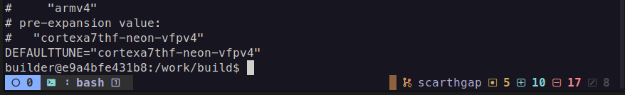
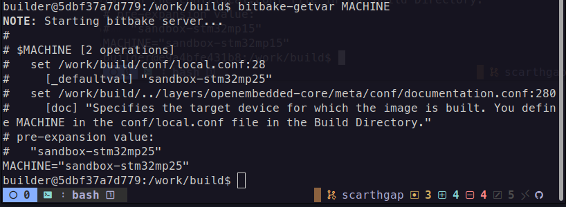
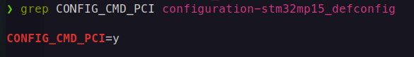

# Milestone 3: BSP & Machine Control

## Goal
Describe and control all hardware behavior through Yocto metadata only.

## Tasks Covered
- [x] Create custom BSP layer
- [x] Register BSP layer in KAS
- [x] Define custom MACHINE configuration
- [x] Define machine overrides correctly
- [x] Define CPU, FPU, and tuning variables
- [x] Validate MACHINE selection via override
- [x] Select bootloader strategy (U-Boot / vendor)
- [x] Integrate bootloader recipe
- [x] Apply bootloader configuration fragments
- [x] Disable unused bootloader features
- [ ] Validate bootloader deployment artifacts
- [ ] Select kernel source strategy (vendor / mainline / custom)
- [ ] Integrate custom kernel recipe
- [ ] Pin kernel version explicitly
- [ ] Apply kernel configuration fragments
- [ ] Validate fragment application order
- [ ] Remove unnecessary kernel options
- [ ] Remove kernel image from root filesystem
- [ ] Integrate base device tree
- [ ] Validate DT selection via MACHINE
- [ ] Create DT overlay recipe
- [ ] Enable DT overlay loading in bootloader
- [ ] Validate overlays load at boot
- [ ] Create kernel module recipes (in-tree / out-of-tree)
- [ ] Control module auto-loading
- [ ] Remove unused drivers
- [ ] Disable unused peripherals and buses
- [ ] Tune clocks, regulators, and power management
- [ ] Measure baseline boot time
- [ ] Enable kernel boot profiling
- [ ] Optimize bootloader delays
- [ ] Optimize kernel and init sequence
- [ ] Validate improved boot time
- [ ] Validate storage drivers and rootfs mount
- [ ] Ensure compatibility with WIC / FlashLayout
- [ ] Enable early boot logs
- [ ] Validate serial console output
- [ ] Validate panic and reboot behavior
- [ ] Ensure BSP logic does not leak into distro or images
- [ ] Document BSP constraints and assumptions

## Implementation

### Create Custom BSP Layer

A dedicated BSP layer was created to host all board-specific configurations and overrides.

```bash
bitbake-layers create-layer meta-sandbox-bsp
```
This layer is responsible exclusively for:

- Machine definitions
- Bootloader customizations
- Kernel configuration fragments
- Hardware-specific overrides

No system policy or image logic is introduced here.

### Register BSP Layer in KAS

The newly created BSP layer was registered in the KAS configuration to ensure reproducible builds.

```yaml
repos:
  meta-sandbox-bsp:
    path: meta-sandbox-bsp
```
Layer priority is increased to ensure that BSP overrides take precedence over vendor layers without modifying them.

```bitbake
BBFILE_PRIORITY_meta-sandbox-bsp = "7"
```

### Define Custom MACHINE Configuration

To define a custom machine, a configuration file was created in the following directory
`meta-sandbox-bsp/conf/machine/sandbox-stm32mp15.conf`. To preserve ST's baseline and allow controlled overrides, the following line must be added at the top of the configuration file created earlier.
```bitbake
require conf/machine/stm32mp15-disco.conf
```
This way, the newly created machine uses ST's configuration by default unless overwritten.

### Define Machine Overrides Correctly

Adding a machine override is essential as it allows for board-specific tuning from now on.
```bitbake
MACHINEOVERRIDES =. "sandbox:"
```
Doing so, I am now able to do something like this:
```bitbake
VARIABLE:sandbox = "value"
```

### Define CPU, FPU, and Tuning Variables

Tuning variables that are provided by ST are already verified and align with STM32MP.
To get the list of default tuning variables, this command must be executed:
```bash
bitbake-getvar DEFAULTTUNE
```


### Narrow BOOTSCHEME_LABELS and BOOTDEVICE_LABELS
The ST defaults enable every possible combination (emmc, nand, nor, sdcard, etc.), which causes the build to generate a huge matrix of FlashLayout files. In this project's case, the application will boot only from SD card with OP-TEE, the other boot options can be disabled for now.
```bitbake
BOOTSCHEME_LABELS = "optee"
BOOTDEVICE_LABELS = "sdcard"
```

### Validate MACHINE Selection via Override

To validate that the custom machine is correctly selected and that overrides are applied as expected:
```bash
bitbake-getvar MACHINE
```


### Select Bootloader Strategy (Vendor U-Boot)

STM32MP157 uses the following boot chain:
```code
ROM => TF-A => U-Boot => Linux => RootFS
```
STM32MP257 uses the following boot chain:
```code
ROM → TF-A (BL2) → FIP → { OP-TEE (BL32) + TF-M + U-Boot (BL33) } → Linux
```
The vendor-provided U-Boot and TF-A are retained to ensure hardware compatibility and stability. The bootloader provider is explicitly set inside the machine configuration provided by ST:
```bitbake
PREFERRED_PROVIDER_virtual/bootloader = "u-boot-stm32mp"
```

### Integrate bootloader recipe

The ST-provided bootloader recipe is already integrated without modification. In order to adjust it to the needs of this project, I created the the following structure and a .bbappend file under meta-sandbox-bsp directory.
```bash
meta-sandbox-bsp/
└── recipes-bsp/
    └── u-boot/
        └── u-boot-stm32mp_%.bbappend
```
This preserves vendor updates while allowing controlled customization.

### Apply bootloader configuration fragments

Bootloader configuration is customized using configuration fragments rather than modifying vendor defconfigs directly. First, I started by creating a defconfig fragment config file under `u-boot/files` named `sandbox_defconfig_fragment.cfg`:

```
meta-sandbox-bsp/recipes-bsp/u-boot/files/sandbox_defconfig_fragment.cfg
```
Before going in-depth on what to disable, i added only one modification to bootloader config to test whether the changes were affected post baking or not.
```cfg
CONFIG_CMD_PCI=y
```
Next, to render the fragment file visible, I referenced it in the `.bbappend` by adding the path to `files` directory, appending the local fragment file to `SRC_URI` variable and appending the fragment file to the `UBOOT_CONFIG_FRAGMENT` so it is seen. These three commands are mentioned below:
```bitbake
FILESEXTRAPATHS:prepend := "${THISDIR}/files:"
SRC_URI += "file://sandbox_defconfig_fragment.cfg"
UBOOT_CONFIG_FRAGMENT += "sandbox_defconfig_fragment.cfg"
```
Now, It is time to validate the changes, build and see if the changes the work done is correct and affected u-boot manufacturer config or not. And thankfully, as can be seen in the screenshot below, it was! Now i can move one and research the features i need only and disabling the rest



### Disable unused bootloader features

The philosophy behind this is simple, as long as i'm not using it now, I disable it. this saves bootloader size and limits the flexibility provided by default.
Currently, this is the list of features disabled:
```cfg
#
# Disable Networking, will re-enable it later to test it
#
CONFIG_NET=n
CONFIG_CMD_NET=n
CONFIG_CMD_DHCP=n
CONFIG_CMD_PING=n
CONFIG_CMD_NFS=n
CONFIG_CMD_TFTPBOOT=n
CONFIG_CMD_WGET=n

#
# Disable Ethernet PHY and drivers
#
CONFIG_PHYLIB=n
CONFIG_DM_ETH=n

#
# Disable unused filesystems, keeping FAT for SD-Card
#
NFIG_CMD_EXT4=n
CONFIG_CMD_EXT2=n
CONFIG_FS_EXT4=y

#
# Disable USB Storage and keeping only Serial communication
#
CONFIG_USB=n
CONFIG_DM_USB=n
CONFIG_DM_USB_GADGET=n
CONFIG_USB_STORAGE=n
CONFIG_CMD_USB=n

#
# Disable Display and graphics for a headless system
#
CONFIG_DM_VIDEO=n
CONFIG_VIDEO=n
CONFIG_LCD=n
CONFIG_CMD_BMP=n
CONFIG_SPLASH_SCREEN=n

#
# Disable compression algorithms
#
CONFIG_LZO=n
CONFIG_LZMA=n
CONFIG_GZIP=n
CONFIG_BZIP2=n
```

### Validate bootloader deployment artifacts